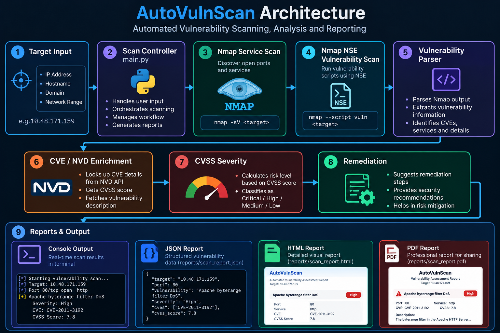

# AutoVulnScan

### Automated Vulnerability Assessment & Reporting Tool

AutoVulnScan is a Python-based vulnerability assessment tool that automates the initial stages of security testing by combining **Nmap service discovery, Nmap NSE vulnerability scanning, vulnerability parsing, CVE/NVD enrichment, CVSS-based severity classification, remediation guidance, SQLite storage, and automated report generation**.

The project was developed as a cybersecurity portfolio project to demonstrate practical skills in **vulnerability assessment, network reconnaissance, vulnerability analysis, Python automation, CVE research, security reporting, and database management**.

---

## 🛡️ Key Features

- 🔎 Nmap service and version detection
- 🧪 Nmap NSE vulnerability scanning
- 🔍 Confirmed vulnerability extraction
- 🧩 Vulnerability parsing with port and service context
- 🆔 CVE identification and NVD enrichment
- 📊 CVSS-based severity classification
- 🚨 Severity levels: Critical, High, Medium, Low, Unknown
- 🛠️ Automated remediation recommendations
- 🗄️ SQLite scan and finding storage
- 📄 JSON report generation
- 🌐 HTML report generation
- 📑 PDF report generation
- 💻 Command-line interface
- 🎯 Target validation
- 🌐 Support for IP addresses, hostnames, and network ranges
- 🧪 Automated unit and integration tests

---

## 🏗️ Architecture



```text
                         ┌──────────────────────┐
                         │      User Target     │
                         │ IP / Host / Network   │
                         └──────────┬───────────┘
                                    │
                                    ▼
                         ┌──────────────────────┐
                         │      CLI / main.py   │
                         │   Scan Controller    │
                         └──────────┬───────────┘
                                    │
                                    ▼
                         ┌──────────────────────┐
                         │   Nmap Service Scan  │
                         │        (-sV)         │
                         └──────────┬───────────┘
                                    │
                                    ▼
                         ┌──────────────────────┐
                         │ Nmap NSE Vulnerability│
                         │        Scan          │
                         └──────────┬───────────┘
                                    │
                                    ▼
                         ┌──────────────────────┐
                         │ Vulnerability Parser │
                         │ Port / Service / CVE │
                         └──────────┬───────────┘
                                    │
                                    ▼
                         ┌──────────────────────┐
                         │   CVE / NVD          │
                         │     Enrichment       │
                         └──────────┬───────────┘
                                    │
                                    ▼
                         ┌──────────────────────┐
                         │   CVSS Severity      │
                         │ Critical → Unknown   │
                         └──────────┬───────────┘
                                    │
                                    ▼
                         ┌──────────────────────┐
                         │    Remediation       │
                         │   Recommendations    │
                         └──────────┬───────────┘
                                    │
                                    ▼
                         ┌──────────────────────┐
                         │ Standardized Finding │
                         │       Model          │
                         └──────────┬───────────┘
                                    │
                  ┌─────────────────┼─────────────────┐
                  ▼                 ▼                 ▼
          ┌──────────────┐  ┌──────────────┐  ┌──────────────┐
          │    SQLite    │  │   Reports    │  │   Console    │
          │   Database   │  │ JSON / HTML  │  │    Output    │
          │              │  │     / PDF    │  │              │
          └──────────────┘  └──────────────┘  └──────────────┘


---

## 🔄 How It Works

AutoVulnScan follows a multi-stage vulnerability assessment pipeline:

### 1. Target Validation

The application validates the supplied target before starting the scan.

Supported targets include:

- IPv4 addresses
- Hostnames
- Network ranges

### 2. Service Discovery

Nmap performs service and version detection using `-sV`.

The scanner identifies information such as:

```text
Port
State
Service
Product
Version

3. Vulnerability Scanning
Nmap NSE vulnerability scripts are executed against the target.
The application focuses on confirmed vulnerability states and avoids treating scan errors or negative results as vulnerabilities.
4. Vulnerability Parsing
The raw Nmap output is parsed into structured findings.
Each finding can contain:
Port
Service
Vulnerability
NSE Script
State
CVE
Evidence

5. CVE / NVD Enrichment
When a vulnerability contains a CVE identifier, AutoVulnScan retrieves available vulnerability information and enriches the finding with:
- CVE identifier
- CVSS score
- CVSS severity information
- Vulnerability description
6. Severity Classification
Severity is assigned using CVSS scores when available.
The classification follows:
CVSS Score	Severity
9.0 – 10.0	Critical
7.0 – 8.9	High
4.0 – 6.9	Medium
0.1 – 3.9	Low
0.0 / unavailable	Unknown


Script-specific severity rules can also be used where appropriate.
7. Remediation
The finding engine generates remediation guidance based on the detected vulnerability.
8. Storage & Reporting
Scan information and findings are stored in SQLite.
Reports are generated in:
- JSON
- HTML
- PDF
🔍 Example Scan
AutoVulnScan was tested against an authorized TryHackMe lab target.
Example confirmed finding:
Target:        10.48.171.159
Port:          80
Service:       http
Vulnerability: Apache byterange filter DoS
Script:        http-vuln-cve2011-3192
State:         VULNERABLE
CVE:           CVE-2011-3192
CVSS Score:    7.8
Severity:      High

This demonstrates the complete workflow:
Nmap Detection
      ↓
Vulnerability Discovery
      ↓
CVE Identification
      ↓
NVD Enrichment
      ↓
CVSS Score
      ↓
Severity Classification
      ↓
Remediation
      ↓
Automated Reports

📊 Reporting
AutoVulnScan generates three report formats.
JSON Report
Machine-readable output suitable for:
- Automation
- Security workflows
- Data processing
- Future integrations
HTML Report
The HTML report provides a browser-friendly security assessment containing:
- Scan information
- Finding summaries
- Severity
- Port and service
- CVE information
- CVSS score
- Evidence
- Remediation guidance
PDF Report
The PDF report provides a portable assessment document containing:
- Scan metadata
- Vulnerability summary
- Finding details
- Severity
- CVE/CVSS information
- Evidence
- Remediation recommendations
🗄️ Database
AutoVulnScan uses SQLite to store scan history and vulnerability findings.
The database stores information such as:
- Scan ID
- Target
- Port
- Service
- Vulnerability
- NSE script
- Vulnerability state
- Severity
- CVE
- CVSS score
- CVSS severity
- Description
- Evidence
- Remediation
The local SQLite database is intentionally excluded from Git using .gitignore.
📁 Project Structure
AutoVulnScan/
│
├── scanner/
│   ├── cve_lookup.py
│   ├── finding_model.py
│   ├── nmap_scanner.py
│   ├── remediation.py
│   ├── service_detector.py
│   ├── severity.py
│   ├── vulnerability_parser.py
│   └── vulnerability_scanner.py
│
├── reporting/
│   ├── html_report.py
│   ├── json_report.py
│   └── pdf_report.py
│
├── database/
│   └── database.py
│
├── tests/
│   ├── test_cve_lookup.py
│   ├── test_database.py
│   ├── test_finding_model.py
│   ├── test_html_report.py
│   ├── test_json_report.py
│   ├── test_main.py
│   ├── test_nmap_scanner.py
│   ├── test_pdf_report.py
│   ├── test_remediation.py
│   ├── test_service_detector.py
│   ├── test_severity.py
│   └── test_vulnerability_parser.py
│
├── config/
├── screenshots/
├── main.py
├── requirements.txt
├── pytest.ini
├── README.md
└── .gitignore

🛠️ Technologies Used
Programming
- Python
- SQL
- Bash
Security Tools
- Nmap
- Nmap NSE
- CVE / NVD
- CVSS
Development
- SQLite
- PyYAML
- Requests
- ReportLab
- pytest
- Rich
Operating System
- Kali Linux
⚙️ Installation
1. Clone the repository
git clone https://github.com/Devapriya10/AutoVulnScan.git
cd AutoVulnScan

2. Create a virtual environment
python3 -m venv venv

3. Activate the virtual environment
source venv/bin/activate

4. Install dependencies
pip install -r requirements.txt

5. Verify Nmap
nmap --version

🚀 Usage
Run the scanner with:
python main.py

The application will guide you through the target scanning process.
Only scan systems that you own or have explicit authorization to test.
🧪 Testing
The project includes automated tests covering:
- Nmap scanning
- Service detection
- Vulnerability parsing
- CVE enrichment
- Severity classification
- Remediation
- Finding model
- Database operations
- JSON reporting
- HTML reporting
- PDF reporting
- Main application workflow
Run the complete test suite:
python -m pytest -v

Current test suite:
58 passed

🔐 Security Considerations
AutoVulnScan is intended for authorized security testing and educational use.
The scanner may perform active network scanning and vulnerability checks. Running vulnerability scans against systems without authorization may be illegal or disruptive.
Always obtain explicit permission before scanning a target.
⚠️ Limitations
AutoVulnScan is designed as an automated vulnerability assessment tool and should not be considered a replacement for a complete professional penetration test.
Current limitations include:
- Detection depends on Nmap NSE script coverage.
- Some vulnerabilities may require manual verification.
- CVE enrichment depends on the availability of NVD information.
- Not every vulnerability has a CVE.
- Some Nmap scripts may return inconclusive results.
- Automated remediation recommendations should be manually reviewed.
- The tool does not perform full exploitation of discovered vulnerabilities.
🔮 Future Enhancements
Potential future improvements include:
- Web application vulnerability scanning
- Additional vulnerability data sources
- More comprehensive CVSS handling
- Authentication-aware scanning
- Scan result comparison
- Dashboard interface
- Docker support
- CI/CD integration
- Expanded security test coverage
- Additional report customization
📌 Project Purpose
This project was developed to demonstrate practical cybersecurity and Python development skills through an end-to-end automated vulnerability assessment workflow.
It combines concepts from:
- Vulnerability Assessment
- Network Security
- Penetration Testing
- Security Automation
- Python Development
- CVE Research
- Risk Classification
- Security Reporting
⚖️ Disclaimer
AutoVulnScan is intended strictly for authorized security testing, cybersecurity education, and research.
The author is not responsible for misuse of this software or unauthorized scanning activities.
👩‍💻 Author
Deva Priya
Computer Science Graduate | Cybersecurity Enthusiast
GitHub:
https://github.com/Devapriya10
⭐ If you find this project useful, consider giving the repository a star.
